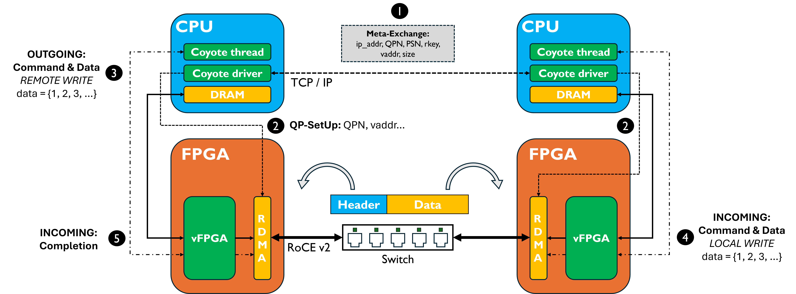
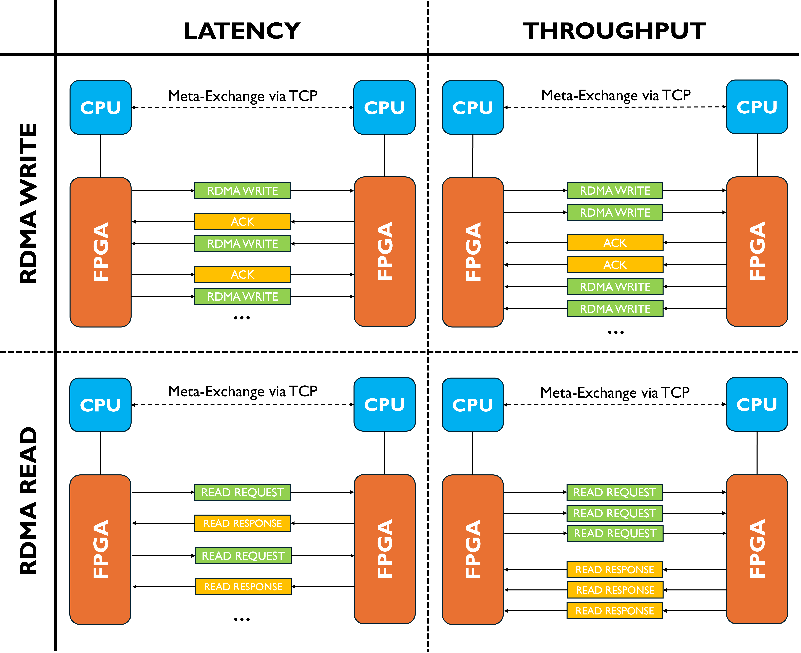

# Coyote Example 13: Multi-node pairwise RDMA QP setup
Welcome to the thirteenth Coyote example! Building on the RDMA concepts introduced in earlier examples, this example demonstrates how Coyote can establish RDMA Queue Pair (QP) connections between **n nodes** (2 ≤ n ≤ 10) in a fully pairwise fashion — every node gets one QP to every other node, giving n*(n-1)/2 QPs in total. No RDMA transfers are performed from software; the QP connections are purely established here so that RDMA can later be triggered directly from hardware.

##### Table of Contents
[RDMA Overview](#rdma-overview)

[Example Overview](#example-overview)

[Multi-node QP Setup](#multi-node-qp-setup)

[Hardware Concepts](#hardware-concepts)

[Software Concepts](#software-concepts)

[Additional Information](#additional-information)

## RDMA Overview
Remote Direct Memory Access over Converged Ethernet (RoCE v2) is a high-performance networking protocol originally developed for High-Performance Computing. It aims to combine high throughput, low latency and low CPU-utilization by offloading the network stack and direct memory access to the Network Interface Card (NIC), thus grounding its performance claims on host-bypassing and zero-copy: applications running on the host CPUs directly expose memory buffers for DMA to the NIC, so that data can be exchanged without including the host CPU or the OS running on it. In this example, we demonstrate how Coyote can be configured to use the FPGA in the role of such a NIC, allowing for fully protocol-compliant RoCE v2-traffic at 100 Gbps. 
For further understanding of the RDMA example, we need to shed some light on the intrinsics of this network standard. 
For RDMA communication, two nodes are connected via a so-called Queue Pair (QP), based on previously exchanged information such as respective IP-addresses, location and size of the allocated memory buffers and access keys, and comprising of the idea of queues for work commands and data. The initial exchange of RDMA operations are managed through so-called InfiniBand-verbs, which describe the form of memory transaction between the remote nodes. We have to separate between *one-sided operations* that initiate data transfers over the network without a previous request for consent, and *two-sided operations* where every data transaction is preceded by an additional exchange between the communicating nodes. Coyote implements the two one-sided RDMA operations: 
- `RDMA WRITE`: One node writes data of certain length to a remote buffer in the other node. Every sent WRITE packet has to be explicitly acknowledged (ACK'ed) by the receiving node. 
- `RDMA READ`: One node requests to read data of certain length from a remote buffer in the other node. The READ REQUEST packet is implicitly ACK'ed when the remote node sends back RDMA RESPONSE packets with the requested data. 

**IMPORTANT TERMINOLOGY:**
To have a better understanding of this example and the following descriptions, a short overview of the RDMA-specific terminology is very helpful: 
- *QPN*: Queue Pair Number. Identifies a RDMA connection between two remote nodes. 
- *vaddr*: Virtual address of the remote exposed buffer. For setting up a Queue Pair, a node has to share the virtual address of its exposed buffer with the remote node. 
- *rkey*: Remote key for accessing the exposed buffer of the remote node. The remote key is communicated alongside the virtual address as a form of access control. 
- *PSN*: Packet Sequence Number used to organize and structure a communication flow between remote RDMA-nodes. Normally, PSN-sequencing is handled by the FPGA-offloaded network stack and thus is not visible to the user. However, following the PSN order is very helpful for debugging RDMA networks. The initial PSN is agreed upon between the remote nodes as part of the initialization of the QP. 
- *MTU*: Maximum Transmission Unit, defines the maximum size of a packet. Since RDMA operates on the notion of buffer transmission, the length of the data to be transmitted determines the number of MTU-sized packets that are required for the operation. While the MTU is a compile-time parameter in Coyote, the default size is 4 KB. This means that a `RDMA WRITE` of a buffer of up to 4 KB size results in a single packet with `RDMA WRITE ONLY` opcode, while a buffer of 8 KB size would be transmitted in two packets, one carrying `RDMA WRITE FIRST`, the other with `RDMA WRITE LAST`. For even longer buffers, an arbitrary number of `RDMA WRITE MIDDLE` packets is inserted in the exchange. 

## Example Overview
This example has two parts:

1. **Multi-node pairwise QP setup** (primary, `INSTANCE=node`): establishes all n*(n-1)/2 QPs between n nodes so that RDMA can subsequently be triggered from hardware. No software-initiated RDMA transfers take place.
2. **Two-node RDMA benchmark** (legacy, `INSTANCE=client`/`server`): measures throughput and latency of RDMA data exchange between two remote nodes via a 100G switched network.

The legacy benchmark description below still applies for the two-node case. The new multi-node setup is described in the [Multi-node QP Setup](#multi-node-qp-setup) section.

---

This example measures throughput and latency of RDMA data exchange between two remote nodes via a 100G switched network with both `RDMA WRITE` and `RDMA READ` operations. Assuming the simpler write functionality, we can very generally think about the process as moving of a data buffer from the host CPU to the local FPGA, where it is streamed to the FPGA-offloaded RDMA stack and then sent via the network to the remote FPGA. There, data is received and then written to the previously specified address of the remote buffer of this remote host CPU. Different to all previous examples, this requires two servers with FPGAs, which also run different software application. The active node, which initiates communication exchange, is referred to as the "client", while the remote node is used as "server". An example of the dataflow is given in the figure below; and as shown in the figure, the steps are the following: 
1) *QP Exchange*: As explained above, the RDMA connection in form of a Queue Pair needs to be set up between the remote nodes before the actual benchmarking test can begin. Since RDMA cannot be bootstrapped, this requires out-of-band communication between the two remote CPUs via classic TCP sockets. In the context of the HACC, we are using the 10G management network for this purpose. Using `ifconfig`, the IP address of the CPU determined to be the server can be evaluated and then given to the experiment code as a parameter. The two nodes follow a standardized protocol to exchange relevant start-up information, such as the IP- addresses of the FPGAs in the 100G data network, the initial PSN and the address and access key of the network exposed data buffers. 
2) *QP Setup*: After having exchanged these essential pieces of information, both CPUs forward the aggregated QP data to the FPGAs to create the endpoints of the RDMA flow in the hardware-offloaded network stack. This means making information such as the target IP address or buffer virtual address retrievable by the QPN as essential key. 
3) *REMOTE WRITE*: In case of a WRITE-based benchmark, the client now begins with a `REMOTE WRITE` Coyote operation to transmit a local buffer via the network to the remote node. For this, both data and commands traverse the vFPGA and reach the RDMA stack on the FPGA, where RoCE v2 packets are created and then sent out via the network. 
4) *Receiving data*: In the above example, the server FPGA receives the incoming RDMA packets and automatically checks for correctness of the PSN-sequence and QP-specific information. If the received packet fits into the expected communication flow, it gets ACK'ed: an `RDMA ACK` is sent back to the client as a reply. At the same time, the server FPGA sends the received data as a `LOCAL WRITE` (see Example 1) to the local buffer on the CPU. 
5) *Processing ACKs & creating completions*: The client FPGA is constantly listening to the network for ACKs for its outstanding packets. If an ACK is received, the original work command for this transaction is marked as completed, which is also communicated to the local client CPU. If no ACK is received within a certain time interval after sending out a packet, a retransmission is issued. In this case, the same packet is sent again, assuming that it was originally lost in the network or not properly received by the server.  

<div align="center">
  
</div>

Generally speaking, throughput and latency tests behave vastly different, also depending on the chosen mode of operation (WRITE vs. READ). The different cases are depicted in the figure below and can be understood as following: 
- *Latency* for `RDMA WRITE`: The client issues a single WRITE of a buffer of specified length to the remote server. Upon reception, the server ACKs and then writes back this very buffer to the client, thus creating a typical "ping-pong pattern" of communication, for which the two-way latency can be measured from sending out a buffer to receiving it back. Depending on the specified experimental arguments, this exchange is repeated for a certain number of times before the average latency of all transmissions is reported. 
- *Throughput* for `RDMA WRITE`: The client issues *n* WRITEs (depending on specification of the argument in experiment execution) of a buffer of specified length to the remote server and waits for all required ACKs. Upon reception, the server writes back the same buffer *n* times again. 
- *Latency* for `RDMA READ`: The client issues a single READ of a buffer of specified length from the remote server. Instead of ACK'ing the server sends the requested data via `RDMA READ RESPONSEs`.  
- *Throughput* for `RDMA READ` In this case, the client issues *n* READs (depending on specification of the argument in experiment execution) of a buffer of specified length from the remote server and waits for data delivery via `RDMA READ RESPONSEs` from there. The server in this case does not issue reflective READs to the client. 

<div align="center">
  
</div>

**IMPORTANT:** When executing RDMA benchmarks, it's important to always start the server's software first before doing the same on the client. The reason for this lies in the intrinsics of the QP exchange: The server software is constructed to listening for incoming TCP connections from the client to then take the passive role in the off-channel exchange of information. 


## Multi-node QP Setup

### Overview

For n nodes, the software establishes n*(n-1)/2 pairwise QP connections — one `cThread` per remote peer, each holding an independent QP with its own QPN. The diagram below shows the connection graph for n=4:

```
node0 ── node1
  │  ╲  ╱  │
  │   ╳   │
  │  ╱  ╲  │
node3 ── node2
```

All 6 pairs (0-1, 0-2, 0-3, 1-2, 1-3, 2-3) are connected. Each node uses the same binary and the same bitstream.

### Port assignment

For each pair (i, j) with i < j, node i acts as the TCP server and node j acts as the TCP client for the out-of-band QP exchange. The TCP port used is:

```
port(i, j) = DEF_PORT + 1 + i * 10 + j
```

All ports are on the management network (CPU-to-CPU TCP, not the 100G RDMA network). With n ≤ 10, ports range from 18489 to 18577 — no manual port configuration is needed.

### Building

The `node` target is the default. Build it on every node with the same command:

```bash
cd sw/
mkdir build && cd build
cmake .. && make
# or explicitly: cmake .. -DINSTANCE=node && make
```

### Running

Launch the same `./test` binary on every node. Each node must be told:
- `-n` / `--n_nodes`: total number of nodes in the cluster (same on all nodes)
- `-d` / `--node_id`: this node's ID, zero-indexed (unique per node)
- `-a` / `--node_ips`: comma-separated list of **all** node CPU IP addresses, in node-ID order (same on all nodes)

There is no required startup order — nodes that are ready earlier will retry their client-side connections until the target server is listening (up to 30 attempts, 1 s apart).

**Example: 3 nodes**

```bash
# On node 0 (IP 10.0.0.0)
./test -n 3 -d 0 -a 10.0.0.0,10.0.0.1,10.0.0.2

# On node 1 (IP 10.0.0.1)
./test -n 3 -d 1 -a 10.0.0.0,10.0.0.1,10.0.0.2

# On node 2 (IP 10.0.0.2)
./test -n 3 -d 2 -a 10.0.0.0,10.0.0.1,10.0.0.2
```

This establishes 3 QP connections: 0↔1, 0↔2, 1↔2.

**Example: 4 nodes**

```bash
# On node 0 (IP 10.0.0.0)
./test -n 4 -d 0 -a 10.0.0.0,10.0.0.1,10.0.0.2,10.0.0.3

# On node 1 (IP 10.0.0.1)
./test -n 4 -d 1 -a 10.0.0.0,10.0.0.1,10.0.0.2,10.0.0.3

# On node 2 (IP 10.0.0.2)
./test -n 4 -d 2 -a 10.0.0.0,10.0.0.1,10.0.0.2,10.0.0.3

# On node 3 (IP 10.0.0.3)
./test -n 4 -d 3 -a 10.0.0.0,10.0.0.1,10.0.0.2,10.0.0.3
```

This establishes 6 QP connections: 0↔1, 0↔2, 0↔3, 1↔2, 1↔3, 2↔3.

### CLI reference for the node binary

| Flag | Long form | Type | Default | Description |
|------|-----------|------|---------|-------------|
| `-n` | `--n_nodes` | uint | required | Total number of nodes (2–10) |
| `-d` | `--node_id` | uint | required | This node's ID, 0-indexed (must be < n_nodes) |
| `-a` | `--node_ips` | string | required | Comma-separated CPU IP addresses of all nodes in node-ID order |
| `-s` | `--buffer_size` | uint64 | 1048576 | Per-QP RDMA buffer size in bytes |

### Expected output

A successful run on node 1 of a 3-node cluster would print something like:

```
=== CLI PARAMETERS: ===
Node ID         : 1
Total nodes     : 3
Total QP pairs  : 3
Buffer size     : 1048576 bytes
Node IPs        :  [0] 10.0.0.0  [1] 10.0.0.1  [2] 10.0.0.2

[node 1] listening for peer 2 on port 18512
[node 1] connecting to peer 0 at 10.0.0.0:18491
Queue pair:
Local:  QPN 0x000001, PSN 0x4a3f21, VADDR ..., SIZE ..., IP ...
Remote: QPN 0x000000, PSN 0x1b2c3d, VADDR ..., SIZE ..., IP ...
Client registered
Server registered
=== QP SETUP COMPLETE ===
Node 1 has established QPs with all 2 peer(s):
  peer 0 (10.0.0.0): buffer @ 0x7f...
  peer 2 (10.0.0.2): buffer @ 0x7f...
```

---

## Hardware Concepts
The core complexity for RDMA in Coyote is hidden from the user within the network stack. In this case, the vFPGA is mainly used for connecting interfaces without any additional user logic required. 
The previously introduced send- and receive-queues are connected as following in the vFPGA: 
```Verilog
always_comb begin 
    /*
     * CONTROL SIGNALS
     * 
     * rq_(wr|rd) are two more Coyote interfaces, which act as inputs to the user application
     * They corresponds to network write/read requests, set from the host software and driver
     * Here, they are used to set Coyote's generic send queues, previously discussed in Example 7.
     */
    // Write
    sq_wr.valid = rq_wr.valid;
    rq_wr.ready = sq_wr.ready;
    sq_wr.data = rq_wr.data;            // Data field holds information such as remote, virtual address, buffer length etc.
    sq_wr.data.strm = STRM_HOST;        // For RDMA, by definition data is always on the host
    sq_wr.data.dest = is_opcode_rd_resp(rq_wr.data.opcode) ? 0 : 1;

    // Reads
    sq_rd.valid = rq_rd.valid;
    rq_rd.ready = sq_rd.ready;
    sq_rd.data = rq_rd.data;           // Data field holds information such as remote, virtual address, buffer length etc.
    sq_rd.data.strm = STRM_HOST;       // For RDMA, by definition data is always on the host
    sq_rd.data.dest = 1;
end
```

On the other hand, the data interfaces are connected as following in the module: 

```Verilog
/*
 * DATA SIGNALS
 * 
 */
// Data streams for outgoing RDMA WRITEs (from local host to network stack to remote node)
`AXISR_ASSIGN(axis_host_recv[0], axis_rreq_send[0])

// Data streams for incoming RDMA READ RESPONSEs (from remote node to network stack to local host)
`AXISR_ASSIGN(axis_rreq_recv[0], axis_host_send[0])

// Data streams for outgoing RDMA READ RESPONSEs (from local host to network stack to remote node)
`AXISR_ASSIGN(axis_host_recv[1], axis_rrsp_send[0])

// Data streams for incoming RDMA WRITEs (from remote node to network stack to local host)
`AXISR_ASSIGN(axis_rrsp_recv[0], axis_host_send[1])
```

Thinking one step further, beyond the scope of this performance benchmark, it becomes obvious how any pipelined user logic can be placed on these interfaces to process incoming or outgoing RDMA traffic. Placing customized user logic directly on these datapaths is one of the key benefits of a FPGA-based SmartNIC such as Coyote with the network configuration. 


## Software Concepts
As described above, the main notion of logic abstraction in RDMA is the Queue-Pair (QP), which connects two remote nodes. Both nodes first form their own local Queue, which again is directly linked to the memory buffer that is exposed via the network. Afterwards, an off-channel exchange via TCP/IP is started to exchange the local queues and then form a QP. 

In Coyote, the notion of a QP is directly linked to a `cThread`. Thus, the first step of setting up RDMA in Coyote  is creating such a thread: 
```C++
coyote::cThread coyote_thread(DEFAULT_VFPGA_ID, getpid());
```

Following the creation of the thread, it's necessary to call the function `initRDMA()`, which allocates an RDMA buffer of the requested size and performs the QP exchange between the client and server. Importantly, the client needs to pass the server's IP address, while the server code leaves this field blank (`nullptr`, indicating that it's the server). The function return a pointer to the memory buffer to be used for RDMA communication.
```C++
int *mem = (int *) coyote_thread.initRDMA(max_size, coyote::DEF_PORT, server_ip.c_str());
```

After the setup is completed, we follow the standard approach in Coyote: creating a scatter-gather entry and issuing an `invoke(...)` call, but this time indicating a remote operation:
```C++
coyote::rdmaSg sg = { .len = curr_size };
coyote_thread.invoke(coyote::CoyoteOper::REMOTE_RDMA_WRITE, sg);
```

## Additional Information 

### Special remarks on building Coyote for RDMA experiments

There are three build targets selectable via `-DINSTANCE`:

| `INSTANCE` | Target | Description |
|-----------|--------|-------------|
| `node` | multi-node pairwise QP setup | **Default.** Single binary runs on all nodes. |
| `server` | legacy 2-node benchmark server | Passive side of the benchmark. |
| `client` | legacy 2-node benchmark client | Active side; initiates transfers. |

**Multi-node setup (default):** build once, deploy the same binary on all nodes.
```bash
cd sw/
mkdir build && cd build
cmake ../ && make          # INSTANCE=node is the default
```

**Legacy 2-node benchmark:** two separate builds are still required since client and server have different code paths.
```bash
cd sw/

mkdir build_server && cd build_server
cmake ../ -DINSTANCE=server && make

cd ../
mkdir build_client && cd build_client
cmake ../ -DINSTANCE=client && make
```

In all cases, both FPGAs use the same bitstream, found in `hw/build/bitstreams/cyt_top.bit`. When
building the hardware, ensure the network submodule was initialized. This is typically done when first downloading Coyote. However, if for some reason the hardware synthesis fails, unable to find the network stack, it can be fixed with:
```bash
git submodule update --init --recursive
```

### Command line parameters and hints on running the experiment
As said above, it's crucial to start the software for experiments first on the node that we want to use as server, before doing the same for the client. Furthermore, it's important that the IP address specified as argument on the client machine **belongs to the server-CPU (not the client CPU, not the server FPGA)**. The different available network interfaces can be explored with `ifconfig`. 
The following description helps to match the relevant command line parameters to details of the experiment execution described before: 

- `[--ip_address | -i] <string>` IP address of the server CPU for out-of-band QP-exchange via TCP-sockets before the actual RDMA experiment can begin. 
- `[--operation | -o] <bool>` Decides whether the benchmark is performed for WRITE (1) or READ (0) operations. Default: 0
- `[--min_size | -x] <uint32_t>` Minimum size of transferred buffer in the experiment. Default: 64 [B]
- `[--max_size | -X] <uint32_t>` Maximum size of transferred buffer in the experiment. Default: 1048576 [B] ~ 1 [MB]
- `[--runs | -r] <uint32_t>` Number of test runs, to obtain statistically significant results For latency-tests, `r` ping-pong exchanges will be executed. For throughput tests, `r` independent exchanges of 64 messages are executed. 

How to synthesize hardware, compile the examples and load the bitstream/driver is explained in the top-level example README in Coyote/examples/README.md. Please refer to that file for general Coyote guidance.

### Help, socket can't bind!
If you get the following error:
```
terminate called after throwing an instance of 'std::runtime_error'
  what():  ERROR: Could not bind a socket
Aborted
```

It means that the socket for out-of-band QP exchange has not been cleaned up by the OS. When a socket is released, it typically enters a `TIME_WAIT` state in which it can still process some connections before being fully released by the OS. There are many ways around this, the simplest of which is to simply wait (sockets are typically fully released within a minute). Alternatively, one can try passing a different port to the `initRDMA(...)` function. Advanced users may choose to modify the function by setting socket properties to reuse sockets that are in `TIME_WAIT` state.

### Network debugging
Coyote provides tooling to check the status of network transmissions and identify potential problems, most notable packet losses and retransmissions. These statistics can be queried via 
`cat /sys/kernel/coyote_sysfs_0/cyt_attr_nstats`. 

A typical output for this could look like this: 
```
 -- NET STATS QSFP0

RX pkgs: 316
TX pkgs: 242
ARP RX pkgs: 4
ARP TX pkgs: 2
ICMP RX pkgs: 0
ICMP TX pkgs: 0
TCP RX pkgs: 0
TCP TX pkgs: 0
ROCE RX pkgs: 245
ROCE TX pkgs: 240
IBV RX pkgs: 240
IBV TX pkgs: 240
PSN drop cnt: 0
Retrans cnt: 0
TCP session cnt: 0
STRM down: 0
```
In this case, 240 RDMA packets have been received and sent (`IBV RX/TX`), no packet has been lost or retransmitted. A major problem would be indicated by `STRM down: 1`, as this would signal a complete shutdown of the networking stack. In such a case, only a hard reset including reprogramming the FPGA can save the user. 
Apart from these Coyote-provided utilities, standard network debugging tools such as switch- or external NIC-based traffic capturing can be used to understand traffic issues and patterns. 
