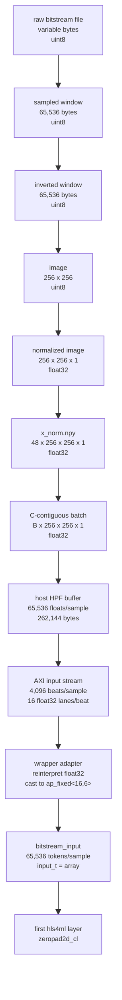
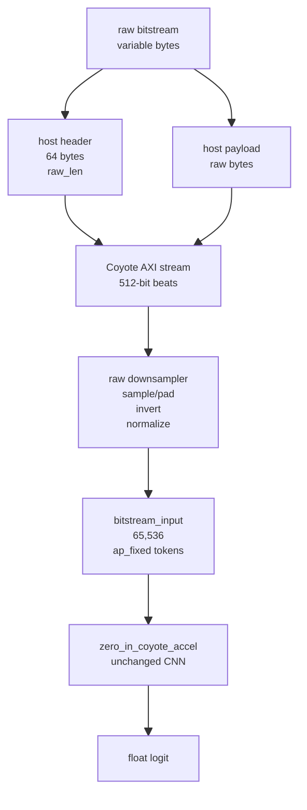
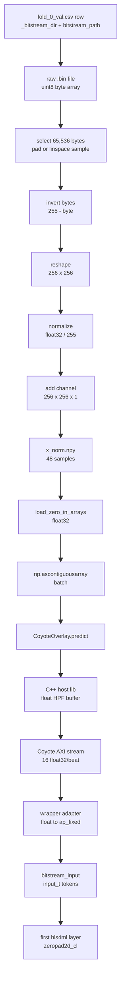
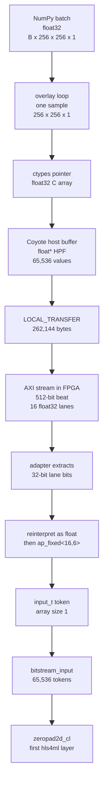

# AGENT_DOWNSAMPLING

Keep this diagnostic focused. User makes decisions.

Scope: CoyoteAccelerator path only.

## End-To-End Data Shape

Global diagram:



Global single-bitstream pseudocode:

```python
IMG_SIZE = 256
N_PIXELS = IMG_SIZE * IMG_SIZE          # 65,536
FLOATS_PER_AXI_BEAT = 512 // 32        # 16
N_AXI_BEATS = N_PIXELS // 16           # 4,096

# offline preparation for one bitstream file
raw = np.fromfile(raw_bitstream_path, dtype=np.uint8)  # (raw_len,)

if len(raw) <= N_PIXELS:
    window = np.zeros(N_PIXELS, dtype=np.uint8)
    window[: len(raw)] = raw                           # (65,536,)
else:
    idx = np.linspace(0, len(raw) - 1, N_PIXELS, dtype=np.int64)
    window = raw[idx]                                  # (65,536,)

window = 255 - window                                  # (65,536,), uint8
image = window.reshape(IMG_SIZE, IMG_SIZE)             # (256, 256), uint8
x = image.astype(np.float32) / 255.0                   # (256, 256), float32
x = x[..., np.newaxis]                                 # (256, 256, 1), float32

# deployed single-sample input object
x = np.ascontiguousarray(x)                            # (256, 256, 1), float32

# inside CoyoteOverlay / generated host library
flat = x.ravel(order="C")                              # 65,536 float32 values
src_hpf = copy_to_coyote_hpf_float_buffer(flat)        # 262,144 bytes
invoke_LOCAL_TRANSFER(src_hpf, dst_hpf)

# inside generated HLS wrapper
for beat in range(N_AXI_BEATS):
    axi_packet = data_in.read()                        # 512 bits = 16 float32 lanes
    for lane in range(FLOATS_PER_AXI_BEAT):
        lane_bits = axi_packet.data[32*lane : 32*(lane+1)]
        value_float = reinterpret_as_float32(lane_bits)
        value_fixed = ap_fixed_16_6(value_float) # convert / re
        bitstream_input.write(input_t([value_fixed]))  # one scalar token

zero_in_coyote_accel(bitstream_input, layer29_out)
zeropad2d_cl(bitstream_input, layer2_out)              # first hls4ml layer
```

## Short Answer

The data passed to CoyoteAccelerator is `x_norm.npy`: a stacked `float32` tensor with shape `(48, 256, 256, 1)`.

Production update: the new raw-input CoyoteAccelerator path sends the original bitstream bytes instead. The host prepends one 64-byte AXI header beat with little-endian `uint64 raw_len`, then streams the raw bitstream payload. The generated HLS wrapper downsamples/inverts/normalizes those bytes before calling the same hls4ml CNN.

Implementation pointers:

```text
scripts/coyote_accelerator/zero_in_synth.py
  patches generated model_wrapper.cpp to call zero_in_raw::raw_bitstream_downsample_to_input_stream(...)
  writes firmware/zero_in_raw_downsample.hpp into each generated project
  patches generated host_libs.* with raw byte input entrypoints
  patches CSim testbench to feed raw files through the production header+payload ABI

scripts/coyote_accelerator/common.py
  loads fold_0_val.csv raw bitstream paths
  reproduces the Python reference downsampling for validation

scripts/coyote_accelerator/zero_in_inference_validate.py
  compares CPU logits from prepared x_norm.npy against FPGA logits from raw bitstream bytes

/pub/scratch/sdeheredia/hls4ml/hls4ml/backends/coyote_accelerator/coyote_accelerator_overlay.py
  adds CoyoteOverlay.predict_raw(...)
```

Raw production diagram:



The mapping is:

```text
original dataset bitstream file
-> read raw bytes as uint8
-> deterministic sample/pad to 256 * 256 = 65,536 bytes
-> invert each byte: 255 - byte
-> reshape to 256 x 256
-> normalize to float32 in [0, 1]
-> add channel dimension: 256 x 256 x 1
-> stack validation samples into x_norm.npy
-> load x_norm.npy as float32
-> pass contiguous batches to CoyoteOverlay.predict()
```

Pseudocode:

```python
IMG_SIZE = 256
N = IMG_SIZE * IMG_SIZE

def prepare_one_sample(row):
    raw_path = Path(row["_bitstream_dir"]) / row["bitstream_path"]
    data = np.fromfile(raw_path, dtype=np.uint8) # raw data from bitstream, interpreted as bytes

    # deterministic padding / downsampling
    if len(data) <= N:
        window = np.zeros(N, dtype=np.uint8)
        window[: len(data)] = data
    else:
        idx = np.linspace(0, len(data) - 1, N, dtype=np.int64)
        window = data[idx]

    window = 255 - window
    x = window.reshape(IMG_SIZE, IMG_SIZE).astype(np.float32) / 255.0
    return x[..., np.newaxis]

xs = [prepare_one_sample(row) for row in fold_0_val_rows]
x_norm = np.stack(xs).astype(np.float32)
np.save("x_norm.npy", x_norm)

x = np.load("x_norm.npy").astype(np.float32)
for x_batch in batches(x):
    fpga = overlay.predict(np.ascontiguousarray(x_batch), (1,), batch_size)
```

Diagram:



## Current Paths

Current zero-in run:

```text
/pub/scratch/sdeheredia/Coyote/examples/ml_baseline/hls4ml/artifacts/cnn_small_hls_opt_img256/notebook_pruned_qat/ZERO_IN_res256_layers5_W8A8_P50_RFbase_07faeca37cb7
```

CoyoteAccelerator input root:

```text
/pub/scratch/sdeheredia/Coyote/examples/ml_baseline/hls4ml/artifacts/cnn_small_hls_opt_img256/notebook_pruned_qat/ZERO_IN_res256_layers5_W8A8_P50_RFbase_07faeca37cb7/hls_sweeps/RFbase_hls_a121fc48614f/fold_0/u55c_deployment/prepared_inputs
```

CoyoteAccelerator input files:

```text
x_norm.npy    normalized float32 tensors, shape (48, 256, 256, 1)
labels.npy    int32 labels, shape (48,)
```

## Example Row

The validation split rows contain both the absolute bitstream root and the relative bitstream path.

Pointer: [fold_0_val.csv](/pub/scratch/sdeheredia/Coyote/examples/ml_baseline/hls4ml/artifacts/cnn_small_hls_opt_img256/notebook_pruned_qat/ZERO_IN_res256_layers5_W8A8_P50_RFbase_07faeca37cb7/splits/fold_0_val.csv:1)

Example sample 0:

```text
_bitstream_dir:
/home/sdeheredia/coyote_vault_work/full_dataset_it1_2026-04-01_production/bitstreams

bitstream_path:
config_003/vfpga_c003_0.bin

full raw input:
/home/sdeheredia/coyote_vault_work/full_dataset_it1_2026-04-01_production/bitstreams/config_003/vfpga_c003_0.bin
```

## Source Code

### 1. Dataset Rows Carry Raw Bitstream Paths

The dataset manifest loader attaches `_bitstream_dir` and keeps `bitstream_path` from each dataset manifest row.

Pointer: [dataset.py](/pub/scratch/sdeheredia/Coyote/examples/ml_baseline/dataset.py:51)

```python
def load_manifest(vault_base=None, min_ro=4000):
    vaults = discover_vaults(vault_base)
    if not vaults:
        raise FileNotFoundError(
            f"No dataset vaults found under {vault_base or VAULT_BASE}"
        )

    samples = []
    for dataset_id, vault_path in vaults:
        manifest_path = os.path.join(vault_path, "manifest.csv")
        bitstream_dir = os.path.join(vault_path, "bitstreams")
        with open(manifest_path, "r") as f:
            reader = csv.DictReader(f)
            for row in reader:
```

Pointer: [dataset.py](/pub/scratch/sdeheredia/Coyote/examples/ml_baseline/dataset.py:82)

```python
bin_path = os.path.join(bitstream_dir, row["bitstream_path"])
if not os.path.isfile(bin_path):
    continue
row["_dataset_id"] = dataset_id
row["_bitstream_dir"] = bitstream_dir
row["sample_id"] = f"{dataset_id}_{row['sample_id']}"
samples.append(row)
```

### 2. The Saved Validation Split Is Reused

The pipeline reads `splits/fold_0_val.csv` back into row dictionaries. Those rows still contain `_bitstream_dir` and `bitstream_path`.

Pointer: [part2_train.py](/pub/scratch/sdeheredia/Coyote/examples/ml_baseline/hls4ml/pipeline/part2_train.py:189)

```python
def get_splits(ctx: FlowContext) -> list[tuple[list[dict], list[dict]]]:
    split_dir = ctx.run_root / "splits"
    expected = [split_dir / f"fold_{fold}_{kind}.csv" for fold in ctx.folds for kind in ("train", "val")]
    if all(path.exists() for path in expected):
        splits = []
        for fold in ctx.folds:
            splits.append((read_csv(split_dir / f"fold_{fold}_train.csv"), read_csv(split_dir / f"fold_{fold}_val.csv")))
        return splits
```

### 3. Prepared Input Directory

The prepared CoyoteAccelerator input root is derived from the selected HLS sweep/fold.

Pointer: [part1_common.py](/pub/scratch/sdeheredia/Coyote/examples/ml_baseline/hls4ml/pipeline/part1_common.py:405)

```python
@property
def u55c_root(self) -> Path:
    return self.hls_sweep_root / f"fold_{self.primary_fold}" / "u55c_deployment"

@property
def prepared_inputs_dir(self) -> Path:
    return self.u55c_root / "prepared_inputs"
```

### 4. Raw Bitstream Bytes Are Sampled Or Padded

This is the actual downsampling rule.

Pointer: [part4_bitstream.py](/pub/scratch/sdeheredia/Coyote/examples/ml_baseline/hls4ml/pipeline/part4_bitstream.py:26)

```python
def bitstream_to_sequence(bin_path: Path, sequence_length: int, invert: bool = True) -> np.ndarray:
    data = np.fromfile(bin_path, dtype=np.uint8)
    if len(data) <= sequence_length:
        window = np.zeros(sequence_length, dtype=np.uint8)
        window[: len(data)] = data
    else:
        indices = np.linspace(0, len(data) - 1, sequence_length, dtype=np.int64)
        window = data[indices]
    return 255 - window if invert else window
```

Meaning:

```text
sequence_length = 256 * 256 = 65,536

if raw file has <= 65,536 bytes:
  copy all bytes, then zero-pad the tail

if raw file has > 65,536 bytes:
  take 65,536 deterministic byte positions from linspace(0, n - 1)
  this includes the first and last byte positions

then:
  invert with 255 - byte
```

### 5. Bytes Become The Zero-In Image Tensor

This maps one row to one normalized NHWC tensor.

Pointer: [part4_bitstream.py](/pub/scratch/sdeheredia/Coyote/examples/ml_baseline/hls4ml/pipeline/part4_bitstream.py:37)

```python
def sample_to_nhwc_for_u55c(ctx: FlowContext, row: dict[str, Any]) -> np.ndarray:
    img_size = int(ctx.config["candidate"]["img_size"])
    bin_path = Path(row["_bitstream_dir"]) / row["bitstream_path"]
    seq = bitstream_to_sequence(bin_path, img_size * img_size, invert=True)
    return (seq.reshape(img_size, img_size).astype(np.float32) / 255.0)[..., np.newaxis]
```

For this config:

Pointer: [res256_layers5_W8A8_P50_RFbase.yaml](/pub/scratch/sdeheredia/Coyote/examples/ml_baseline/hls4ml/configs/hls4ml_experiment/res256_layers5_W8A8_P50_RFbase.yaml:6)

```yaml
candidate:
  img_size: 256
```

### 6. Validation Samples Are Stacked Into `x_norm.npy`

For CoyoteAccelerator, the relevant output of this function is `x_norm.npy` and `labels.npy`.

Pointer: [part4_bitstream.py](/pub/scratch/sdeheredia/Coyote/examples/ml_baseline/hls4ml/pipeline/part4_bitstream.py:56)

```python
def prepare_u55c_inputs(ctx: FlowContext, splits, force: bool = False) -> None:
    fold = ctx.primary_fold
    _, val_samples = splits[fold]
    sample_ids = [row["sample_id"] for row in val_samples]
```

Pointer: [part4_bitstream.py](/pub/scratch/sdeheredia/Coyote/examples/ml_baseline/hls4ml/pipeline/part4_bitstream.py:77)

```python
for idx, row in enumerate(val_samples):
    x = sample_to_nhwc_for_u55c(ctx, row).astype(np.float32)
    flat = x.reshape(-1)
    if flat.size != int(ctx.abi["pixels_per_sample"]):
        raise ValueError(f"unexpected input size {flat.size}")
    all_x.append(x)
    labels.append(int(row["class_label"]))
```

Pointer: [part4_bitstream.py](/pub/scratch/sdeheredia/Coyote/examples/ml_baseline/hls4ml/pipeline/part4_bitstream.py:101)

```python
np.save(ctx.prepared_inputs_dir / "x_norm.npy", np.stack(all_x))
np.save(ctx.prepared_inputs_dir / "labels.npy", np.asarray(labels, dtype=np.int32))
```

Shape check:

```text
48 validation samples
each sample: 256 x 256 x 1
x_norm.npy: (48, 256, 256, 1), float32
labels.npy: (48,), int32
```

### 7. CoyoteAccelerator Scripts Load `x_norm.npy`

The new CoyoteAccelerator scripts do not re-read the original bitstream files. They load the prepared normalized array.

Pointer: [common.py](/pub/scratch/sdeheredia/Coyote/examples/ml_baseline/hls4ml/scripts/coyote_accelerator/common.py:24)

```python
DEFAULT_INPUT_ROOT = (
    DEFAULT_RUN_ROOT
    / "hls_sweeps/RFbase_hls_a121fc48614f/fold_0/u55c_deployment/prepared_inputs"
)
```

Pointer: [common.py](/pub/scratch/sdeheredia/Coyote/examples/ml_baseline/hls4ml/scripts/coyote_accelerator/common.py:83)

```python
def load_zero_in_arrays(input_root: Path = DEFAULT_INPUT_ROOT, n_samples: int | None = None):
    import numpy as np

    x_path = input_root / "x_norm.npy"
    labels_path = input_root / "labels.npy"
    if not x_path.exists():
        raise FileNotFoundError(x_path)
    if not labels_path.exists():
        raise FileNotFoundError(labels_path)
    x = np.load(x_path).astype(np.float32)
    labels = np.load(labels_path).astype(np.int32)
    if n_samples is not None:
        x = x[: int(n_samples)]
        labels = labels[: int(n_samples)]
    return x, labels, x_path, labels_path
```

### 8. Synthesis Uses The Same Float32 Array As Testbench Data

This is not the deployed inference call, but it verifies that the HLS project is generated against the same normalized input representation.

Pointer: [zero_in_synth.py](/pub/scratch/sdeheredia/Coyote/examples/ml_baseline/hls4ml/scripts/coyote_accelerator/zero_in_synth.py:54)

```python
tb_dir = output_dir / "tb_data_np"
tb_dir.mkdir(parents=True, exist_ok=True)
input_tb = tb_dir / "input.npy"
output_tb = tb_dir / "keras_logits.npy"
np.save(input_tb, np.ascontiguousarray(x))
np.save(output_tb, np.ascontiguousarray(keras_logits.reshape(-1, 1).astype(np.float32)))
```

Pointer: [zero_in_synth.py](/pub/scratch/sdeheredia/Coyote/examples/ml_baseline/hls4ml/scripts/coyote_accelerator/zero_in_synth.py:81)

```python
hls_model = convert_from_keras_model(
    model,
    hls_config=hls_config,
    output_dir=str(output_dir / "project"),
    project_name=project_name,
    backend="CoyoteAccelerator",
    io_type="io_stream",
    clock_period=4,
    input_data_tb=str(input_tb),
    output_data_tb=str(output_tb),
)
```

### 9. Deployed Validation Passes Float32 Batches To CoyoteAccelerator

This is the handoff from our prepared tensor to the CoyoteAccelerator Python overlay.

Pointer: [zero_in_inference_validate.py](/pub/scratch/sdeheredia/Coyote/examples/ml_baseline/hls4ml/scripts/coyote_accelerator/zero_in_inference_validate.py:47)

```python
_ctx, model = load_zero_in_model(args.config.resolve(), args.run_root.resolve(), fold=0)
x, labels, x_path, labels_path = load_zero_in_arrays(args.input_root.resolve(), n_samples=args.n_samples)
if len(x) % args.batch_size != 0:
    raise RuntimeError(f"{len(x)} samples is not divisible by batch size {args.batch_size}")
```

Pointer: [zero_in_inference_validate.py](/pub/scratch/sdeheredia/Coyote/examples/ml_baseline/hls4ml/scripts/coyote_accelerator/zero_in_inference_validate.py:60)

```python
n_batches = len(x) // args.batch_size
x_batches = x.reshape((n_batches, args.batch_size, *x.shape[1:]))
for batch_idx, x_batch in enumerate(x_batches):
    cpu = np.asarray(model.predict(x_batch, verbose=0)).reshape(args.batch_size, 1)
    fpga = np.asarray(overlay.predict(np.ascontiguousarray(x_batch), (1,), args.batch_size)).reshape(args.batch_size, 1)
```

So the actual object handed to `CoyoteOverlay.predict()` is:

```text
np.ascontiguousarray(x_batch)

shape: (batch_size, 256, 256, 1)
dtype: float32
values: normalized floats in [0, 1]
```

### 10. Overlay And Host Library Keep Float32 Host Buffers

The overlay enforces float-like input and initializes the Coyote host library with the flattened sample size.

Pointer: [coyote_accelerator_overlay.py](/pub/scratch/sdeheredia/hls4ml/hls4ml/backends/coyote_accelerator/coyote_accelerator_overlay.py:54)

```python
def predict(self, X: np.array, y_shape: tuple, batch_size: int = 1):
    if len(X.shape) == 1:
        X = np.array([X])
    if not (isinstance(X.dtype, float) or isinstance(X.dtype, np.float32)):
        logging.warning('CoyoteOverlay only supports (for now) floating-point inputs; casting input data to float')
        X = X.astype(np.float32)
    y = np.empty((len(X), *y_shape))
    np_pointer_nd = np.ctypeslib.ndpointer(dtype=np.float32, ndim=len(X[0].shape), flags='C')
    self.coyote_lib.set_inference_data.argtypes = [ctypes.POINTER(ctypes.c_void_p), np_pointer_nd, ctypes.c_uint]

    model = self.coyote_lib.init_model_inference(batch_size, int(np.prod(X[0].shape)), int(np.prod(y_shape)))
```

Pointer: [coyote_accelerator_overlay.py](/pub/scratch/sdeheredia/hls4ml/hls4ml/backends/coyote_accelerator/coyote_accelerator_overlay.py:78)

```python
for x in X:
    self.coyote_lib.set_inference_data(model, x, cnt)
    cnt += 1
    if cnt == batch_size:
        self.coyote_lib.flush(model)

        ts = time.time_ns()
        self.coyote_lib.predict(model)
        te = time.time_ns()
```

The generated host library allocates float buffers and copies the flattened normalized sample into Coyote huge-page memory.

Pointer: [host_libs.cpp](/pub/scratch/sdeheredia/hls4ml/hls4ml/templates/coyote_accelerator/host_libs.cpp:3)

```cpp
CoyoteInference::CoyoteInference(unsigned int batch_size, unsigned int in_size, unsigned int out_size):
    batch_size(batch_size), in_size(in_size), out_size(out_size),
    coyote_thread(DEFAULT_VFPGA_ID, getpid())
{
    for (unsigned int i = 0; i < batch_size; i++) {
        src_mems.emplace_back((float *) coyote_thread.getMem({coyote::CoyoteAllocType::HPF, (uint) (in_size * sizeof(float))}));
        dst_mems.emplace_back((float *) coyote_thread.getMem({coyote::CoyoteAllocType::HPF, (uint) (out_size * sizeof(float))}));
```

Pointer: [host_libs.cpp](/pub/scratch/sdeheredia/hls4ml/hls4ml/templates/coyote_accelerator/host_libs.cpp:45)

```cpp
void CoyoteInference::set_data(float *x, unsigned int i) {
    for (int j = 0; j < in_size; j++) {
        src_mems[i][j] = x[j];
    }
}
```

## After `CoyoteOverlay.predict`

This section starts at the object passed here:

```python
overlay.predict(np.ascontiguousarray(x_batch), (1,), args.batch_size)
```

Data shape at that call:

```text
x_batch:
  shape: (batch_size, 256, 256, 1)
  dtype: float32
  layout: C-contiguous after np.ascontiguousarray(...)
  values: normalized floats in [0, 1]
```

Post-predict flow:



Pseudocode:

```python
# Python side
x_batch = np.ascontiguousarray(x_batch)        # (B, 256, 256, 1), float32
for sample in x_batch:
    set_inference_data(model, sample, slot)    # ctypes passes float32 C buffer

# C++ host library
in_size = 256 * 256 * 1
src_mems[slot] = HPF_allocate(in_size * sizeof(float))
for j in range(in_size):
    src_mems[slot][j] = sample_flat_c_order[j]

invoke_LOCAL_TRANSFER(src_mems[slot], dst_mems[slot])

# FPGA wrapper input side
for beat in range(4096):                       # 65,536 floats / 16 floats per beat
    pkt = data_in.read()                       # 512-bit AXI packet
    for lane in range(16):
        bits = pkt.data[32*lane : 32*(lane+1)]
        value_float = reinterpret_as_float(bits)
        token = input_t(ap_fixed_16_6(value_float))
        bitstream_input.write(token)

zero_in_coyote_accel(bitstream_input, layer29_out)
zeropad2d_cl(bitstream_input, layer2_out)      # first hls4ml layer
```

### Overlay: Batch To Per-Sample Pointer

The overlay receives a batch but iterates one sample at a time. It declares the sample pointer as a C-contiguous `float32` NumPy pointer.

Pointer: [coyote_accelerator_overlay.py](/pub/scratch/sdeheredia/hls4ml/hls4ml/backends/coyote_accelerator/coyote_accelerator_overlay.py:54)

```python
def predict(self, X: np.array, y_shape: tuple, batch_size: int = 1):
    if len(X.shape) == 1:
        X = np.array([X])
    if not (isinstance(X.dtype, float) or isinstance(X.dtype, np.float32)):
        logging.warning('CoyoteOverlay only supports (for now) floating-point inputs; casting input data to float')
        X = X.astype(np.float32)
    y = np.empty((len(X), *y_shape))
    np_pointer_nd = np.ctypeslib.ndpointer(dtype=np.float32, ndim=len(X[0].shape), flags='C')
    self.coyote_lib.set_inference_data.argtypes = [ctypes.POINTER(ctypes.c_void_p), np_pointer_nd, ctypes.c_uint]

    model = self.coyote_lib.init_model_inference(batch_size, int(np.prod(X[0].shape)), int(np.prod(y_shape)))
```

Pointer: [coyote_accelerator_overlay.py](/pub/scratch/sdeheredia/hls4ml/hls4ml/backends/coyote_accelerator/coyote_accelerator_overlay.py:78)

```python
for x in X:
    self.coyote_lib.set_inference_data(model, x, cnt)
    cnt += 1
    if cnt == batch_size:
        self.coyote_lib.flush(model)
        self.coyote_lib.predict(model)
```

For zero-in:

```text
X[0].shape = (256, 256, 1)
np.prod(X[0].shape) = 65,536
in_size = 65,536 float values
```

### Host Library: Float Buffer To Coyote Transfer

The generated host library allocates one input HPF buffer per batch slot. The transfer length is in bytes and is based on `float`.

Pointer: [host_libs.cpp](/pub/scratch/sdeheredia/Coyote/examples/ml_baseline/hls4ml/artifacts/coyote_accelerator_zero_in_e2e/20260509_173826/project/src/host_libs.cpp:3)

```cpp
CoyoteInference::CoyoteInference(unsigned int batch_size, unsigned int in_size, unsigned int out_size):
    batch_size(batch_size), in_size(in_size), out_size(out_size),
    coyote_thread(DEFAULT_VFPGA_ID, getpid())
{
    for (unsigned int i = 0; i < batch_size; i++) {
        src_mems.emplace_back((float *) coyote_thread.getMem({coyote::CoyoteAllocType::HPF, (uint) (in_size * sizeof(float))}));
        dst_mems.emplace_back((float *) coyote_thread.getMem({coyote::CoyoteAllocType::HPF, (uint) (out_size * sizeof(float))}));
        coyote::localSg src_sg = { .addr = src_mems[i], .len = (uint) (in_size * sizeof(float))};
        coyote::localSg dst_sg = { .addr = dst_mems[i], .len = (uint) (out_size * sizeof(float))};
```

The copy keeps values as float32 and flattens by normal C memory order.

Pointer: [host_libs.cpp](/pub/scratch/sdeheredia/Coyote/examples/ml_baseline/hls4ml/artifacts/coyote_accelerator_zero_in_e2e/20260509_173826/project/src/host_libs.cpp:45)

```cpp
void CoyoteInference::set_data(float *x, unsigned int i) {
    for (int j = 0; j < in_size; j++) {
        src_mems[i][j] = x[j];
    }
}
```

Then Coyote transfers host memory into the vFPGA.

Pointer: [host_libs.cpp](/pub/scratch/sdeheredia/Coyote/examples/ml_baseline/hls4ml/artifacts/coyote_accelerator_zero_in_e2e/20260509_173826/project/src/host_libs.cpp:33)

```cpp
void CoyoteInference::predict() {
    for (int i = 0 ; i < batch_size; i++) {
        coyote_thread.invoke(coyote::CoyoteOper::LOCAL_TRANSFER, src_sgs[i], dst_sgs[i]);
    }
    while (coyote_thread.checkCompleted(coyote::CoyoteOper::LOCAL_TRANSFER) != batch_size) {}
}
```

For one sample:

```text
65,536 float32 values
262,144 input bytes
512-bit AXI beat = 64 bytes
262,144 / 64 = 4,096 input beats
```

### HLS Wrapper: AXI Stream To hls4ml Stream

Coyote connects to the wrapper through `data_in`, a 512-bit AXI stream. The hls4ml CNN is not called directly by Coyote.

Pointer: [model_wrapper.cpp](/pub/scratch/sdeheredia/Coyote/examples/ml_baseline/hls4ml/artifacts/coyote_accelerator_zero_in_e2e/20260509_173826/project/src/hls/model_wrapper/model_wrapper.cpp:20)

```cpp
void model_wrapper (
    hls::stream<axi_s> &data_in,
    hls::stream<axi_s> &data_out
) {
    #pragma HLS INTERFACE ap_ctrl_none port=return
    #pragma HLS INTERFACE axis register port=data_in name=data_in
    #pragma HLS INTERFACE axis register port=data_out name=data_out
```

The wrapper creates the hls4ml input stream, converts AXI float lanes into `input_t`, then calls the CNN.

Pointer: [model_wrapper.cpp](/pub/scratch/sdeheredia/Coyote/examples/ml_baseline/hls4ml/artifacts/coyote_accelerator_zero_in_e2e/20260509_173826/project/src/hls/model_wrapper/model_wrapper.cpp:28)

```cpp
hls::stream<input_t> bitstream_input("bitstream_input");
#pragma HLS STREAM variable=bitstream_input depth=65536

nnet::axi_stream_to_data<input_t, float, 256*256*1, COYOTE_AXI_STREAM_BITS, 8 * sizeof(float)>(data_in, bitstream_input);
zero_in_coyote_accel(bitstream_input,layer29_out);
```

For zero-in, one hls4ml input token is one scalar fixed-point value.

Pointer: [defines.h](/pub/scratch/sdeheredia/Coyote/examples/ml_baseline/hls4ml/artifacts/coyote_accelerator_zero_in_e2e/20260509_173826/project/src/hls/model_wrapper/firmware/defines.h:17)

```cpp
typedef nnet::array<ap_fixed<16,6>, 1*1> input_t;
```

The adapter reads each 512-bit AXI beat, extracts 16 lanes of 32 bits, reinterprets each lane as a `float`, then casts the float into the fixed-point `input_t` stream element.

Pointer: [nnet_axi_utils_stream.h](/pub/scratch/sdeheredia/Coyote/examples/ml_baseline/hls4ml/artifacts/coyote_accelerator_zero_in_e2e/20260509_173826/project/src/hls/model_wrapper/firmware/nnet_utils/nnet_axi_utils_stream.h:44)

```cpp
template <class array_T, class axi_T, unsigned int SIZE, unsigned int AXI_BITS, unsigned int PRECISION>
void axi_stream_to_data(hls::stream<ap_axiu<AXI_BITS, 0, 0, 0>> &axi_in, hls::stream<array_T> &data_out) {
    #pragma HLS INLINE OFF
    constexpr const unsigned int ELEMENTS_PER_AXI = (SIZE <= (AXI_BITS / PRECISION)) ? SIZE : (AXI_BITS / PRECISION);
    constexpr const unsigned int NUM_BEATS = SIZE / ELEMENTS_PER_AXI + (SIZE % ELEMENTS_PER_AXI != 0);

    array_T tmp;
    unsigned int index = 0;

    for (int i = 0; i < NUM_BEATS; i++) {
        #pragma HLS PIPELINE II=1
        ap_axiu<AXI_BITS, 0, 0, 0> axi_packet = axi_in.read();

        for (int j = 0; j < ELEMENTS_PER_AXI; j++) {
            #pragma HLS UNROLL
            ap_uint<PRECISION> axi_bits = axi_packet.data.range((j + 1) * PRECISION - 1, j * PRECISION);
            axi_T axi_tmp = *reinterpret_cast<axi_T*>(&axi_bits);
            tmp[index] = typename array_T::value_type(axi_tmp);
            index++;
            if (index == array_T::size) {
                index = 0;
                data_out.write(tmp);
            }
        }
    }
}
```

For this instantiation:

```text
SIZE = 256 * 256 * 1 = 65,536 values
AXI_BITS = 512
PRECISION = 8 * sizeof(float) = 32
ELEMENTS_PER_AXI = 512 / 32 = 16 float lanes
NUM_BEATS = 65,536 / 16 = 4,096 beats
array_T = input_t = nnet::array<ap_fixed<16,6>, 1>
array_T::size = 1
```

So each float lane becomes one `input_t` token:

```text
host float32 value
-> 32 raw bits in AXI lane
-> reinterpret as float in wrapper
-> cast to ap_fixed<16,6>
-> wrapped in nnet::array<..., 1>
-> written to bitstream_input
```

### First hls4ml Layer

The CNN top receives `bitstream_input` as an hls4ml stream.

Pointer: [zero_in_coyote_accel.cpp](/pub/scratch/sdeheredia/Coyote/examples/ml_baseline/hls4ml/artifacts/coyote_accelerator_zero_in_e2e/20260509_173826/project/src/hls/model_wrapper/firmware/zero_in_coyote_accel.cpp:7)

```cpp
void zero_in_coyote_accel(
    hls::stream<input_t> &bitstream_input,
    hls::stream<result_t> &layer29_out
) {
    #pragma HLS INLINE OFF
    #pragma HLS DATAFLOW
```

The first hls4ml layer consumes that stream.

Pointer: [zero_in_coyote_accel.cpp](/pub/scratch/sdeheredia/Coyote/examples/ml_baseline/hls4ml/artifacts/coyote_accelerator_zero_in_e2e/20260509_173826/project/src/hls/model_wrapper/firmware/zero_in_coyote_accel.cpp:103)

```cpp
auto& layer28_out = layer27_out;
nnet::zeropad2d_cl<input_t, layer2_t, config2>(bitstream_input, layer2_out); // pad_conv0
```

Net effect before the first hls4ml layer:

```text
No more spatial downsampling happens.
Ordering remains the C-contiguous flattened order of x_batch.
Representation changes from host float32 to hls4ml ap_fixed<16,6>.
The first hls4ml layer sees 65,536 scalar stream tokens for one image.
```

## Runtime Shape

For one zero-in sample in the CoyoteAccelerator path:

```text
image shape:             256 x 256 x 1
values/sample:           65,536
host dtype:              float32
host bytes/sample:       65,536 * 4 = 262,144
Coyote host buffer type: float*
overlay batch shape:     (batch_size, 256, 256, 1)
```

After this point, Coyote transfers the float32 host buffer to the generated HLS wrapper. The wrapper converts float32 AXI lanes to the hls4ml fixed-point `input_t`; that is no longer downsampling.

## Invariants To Check

```text
1. fold_0_val.csv row has the intended _bitstream_dir and bitstream_path.
2. img_size is 256, so sequence_length is 65,536.
3. x_norm.npy is float32 with shape (48, 256, 256, 1).
4. zero_in_inference_validate.py uses the same input_root that contains that x_norm.npy.
5. overlay.predict receives np.ascontiguousarray(x_batch), not a different encoding.
```
